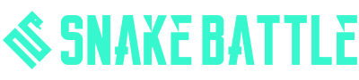

# Snake Battle


<div align="center">
    
</div>


Using a combination of **HTML**, **SCSS** and pure **JavaScript / ES6** to create a Snake Battle Game.
The initial ideal for this game is use different combinations of web languages and web services,
to create a simple game with multiple options.
In the current version of game you can play with yourself, in the future in can challenge other players.


You can play `Snake Battle` in [Github Page](http://maurovieirareis.github.io/snake).

## Supported Browsers:
- Google Chrome 62+
- Google Canary 63+
- Opera +47
- Safari 11+
- ~~Firefox~~

### ⚗️ Technology used?
1. NPM & Gulp
2. Rollup JS
3. HTML, SCSS (CSS), Typescript (JavaScript)
4. MD5 Hash ( used to ecrypt email to get photo in Gravatar API)
4. Firebase
5. Browser Storage
6. Browser Notification

### Clone the repo using Git

```bash
git clone https://github.com/maurovieirareis/snake
```


Alternatively you can [download](https://codeload.github.com/maurovieirareis/snake/zip/master) this repository.

## License

The Stewed is open-sourced software licensed under the [MIT license](http://opensource.org/licenses/MIT)

Created with ♥️ by [@mauroreisvieira](https://twitter.com/mauroreisvieira) in **Portugal**


